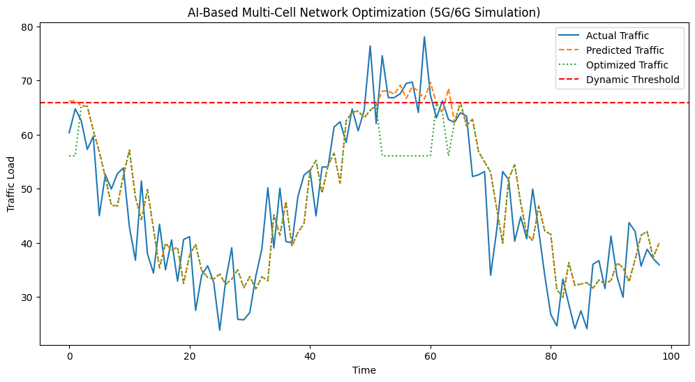
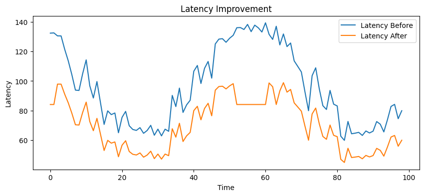

# 📡 AI-Based Multi-Cell Network Optimization (5G/6G Simulation)

## 🚀 Overview
This project simulates a **multi-cell wireless network environment (inspired by 5G/6G systems)** and applies **AI-driven optimization techniques** to reduce congestion, latency, and improve Quality of Service (QoS).

The system predicts network traffic using machine learning and dynamically applies control strategies such as **adaptive congestion control** and **load balancing**, mimicking real-world telecom network behavior.

---

## ▶️ Run on Colab
[Open in Colab](https://colab.research.google.com/drive/1dq8h6bBlYOMVn3pvw0RCdfJ1xS88mi4H?usp=sharing)

---

## 🎯 Key Highlights
- 🔥 **100% congestion reduction** (12 → 0 events)
- ⚡ **~27% latency reduction**
- 📈 **QoS improved from 0.88 → 1.00**
- 🔋 Reduced energy consumption
- 🧠 Combines **Machine Learning + Systems Optimization**

---

## 🧠 Problem Statement
Modern wireless networks (5G/6G) face:
- High traffic from multiple users  
- Congestion leading to delays and packet loss  
- Need for real-time intelligent optimization  

👉 **Goal:**  
Predict future traffic and proactively optimize the network to prevent congestion and improve performance.

---

## ⚙️ System Architecture

---

## 🧩 Components Explained

### 📡 1. Multi-Cell Simulation
- Simulates multiple base stations (RAN concept)
- Each cell generates slightly different traffic patterns
- Represents distributed network behavior

---

### 🤖 2. Traffic Prediction (Machine Learning)
- Model: **Random Forest Regressor**
- Learns patterns from historical traffic
- Predicts future network load

---

### 🚨 3. Congestion Detection
- Uses a **dynamic threshold** based on traffic distribution
- Detects overload conditions before they happen

---

### ⚡ 4. Adaptive Optimization
- Applies dynamic control based on congestion severity
- Reduces traffic intelligently instead of fixed rules

---

### 🔄 5. Load Balancing
- Redistributes traffic across cells
- Mimics real-world **RAN optimization strategies**

---

## 📊 Results

| Metric | Before | After |
|-------|--------|-------|
| Congestion Events | 12 | 0 |
| Latency | 96.04 | 69.90 |
| QoS | 0.88 | 1.00 |
| Energy Consumption | High | Reduced |

---

## 📈 Visualization

### 📊 Traffic Optimization
- 🔵 Blue → Actual Traffic  
- 🟠 Orange → Predicted Traffic  
- 🟢 Green → Optimized Traffic  
- 🔴 Red → Congestion Threshold  

👉 Optimized traffic remains below threshold → **no congestion**

---

### ⚡ Latency Improvement
- Significant reduction after optimization  
- Demonstrates improved real-time system performance  

---

## 🧠 Key Concepts

### 🤖 Machine Learning
- Random Forest (ensemble learning)
- Time-series prediction
- Model evaluation (MSE)

---

### ⚙️ Systems & Networking
- Latency vs Throughput
- Congestion Control
- QoS (Quality of Service)
- Load Balancing

---

### 📡 5G/6G Mapping

| Project Component | Real-World Equivalent |
|------------------|----------------------|
| Cells | Base Stations (RAN) |
| Traffic | User Data |
| Optimization | Network Scheduling |
| Latency | Network Delay |
| QoS | User Experience |

---

## 🔬 Why This Project Matters
- Demonstrates **AI + Systems integration**
- Simulates real-world telecom challenges
- Shows ability to design **intelligent adaptive systems**
- Relevant for **5G/6G network optimization research**

---

## 🛠️ Tech Stack
- Python  
- Scikit-learn  
- NumPy  
- Pandas  
- Matplotlib  

---

## 🚀 How to Run

### Option 1: Google Colab (Recommended)
1. Click the "Open in Colab" link above  
2. Run all cells sequentially  
3. View outputs (plots + metrics)

---

### Option 2: Run Locally (Jupyter Notebook)

```bash
# Clone the repository
git clone https://github.com/your-username/your-repo-name.git

# Navigate into project directory
cd your-repo-name

# Install dependencies
pip install -r requirements.txt

# Launch Jupyter Notebook
jupyter notebook

#open the .ipynb file
AI-Based Network Congestion Control.ipynb
```



## 👨‍💻 Author

**Jaya Sandeep Nadipalli**  
M.Tech Data Science & AI, IIT Tirupati  

📧 Email: nadipalli.sandeep8@gmail.com
🔗 LinkedIn: https://linkedin.com/in/jayasandeep

